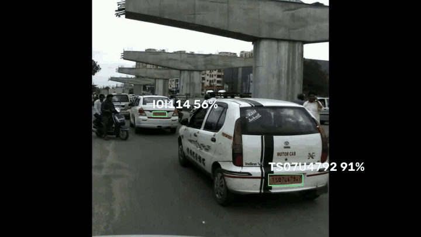

# anpr-ocr

[](.github/workflows/ci.yml)
[](https://github.com/astral-sh/ruff)
[](https://github.com/pylint-dev/pylint)
[](http://mypy-lang.org/)
[](https://onnx.ai/)
[](https://www.python.org/)
[](./LICENSE)



**anpr-ocr** is a high-performance, customizable Automatic License Plate Recognition (ALPR) system. We offer fast and
efficient ONNX models by default, but you can easily swap in your own models if needed.

For Optical Character Recognition (**OCR**), we use [fast-plate-ocr](https://pypi.org/project/fast-plate-ocr/) by
default, and for **license plate detection**, we
use [open-image-models](https://pypi.org/project/open-image-models/). However, you can integrate any OCR or detection
model of your choice.

## 📋 Table of Contents

* [✨ Features](#-features)
* [📦 Installation](#-installation)
* [🚀 Quick Start](#-quick-start)
* [🛠️ Customization and Flexibility](#-customization-and-flexibility)
* [📖 Documentation](#-documentation)
* [🤝 Contributing](#-contributing)
* [🙏 Acknowledgements](#-acknowledgements)
* [📫 Contact](#-contact)

## ✨ Features

- **High Accuracy**: Uses advanced models for precise license plate detection and OCR.
- **Customizable**: Easily switch out detection and OCR models.
- **Easy to Use**: Quick setup with a simple API.
- **Out-of-the-Box Models**: Includes ready-to-use detection and OCR models
- **Fast Performance**: Optimized with ONNX Runtime for speed.

## 📦 Installation

```shell
pip install anpr-ocr[onnx-gpu]
```

By default, **no ONNX runtime is installed**. To run inference, you **must** install at least one ONNX backend using an appropriate extra.

| Platform/Use Case  | Install Command                        | Notes                |
|--------------------|----------------------------------------|----------------------|
| CPU (default)      | `pip install anpr-ocr[onnx]`          | Cross-platform       |
| NVIDIA GPU (CUDA)  | `pip install anpr-ocr[onnx-gpu]`      | Linux/Windows        |
| Intel (OpenVINO)   | `pip install anpr-ocr[onnx-openvino]` | Best on Intel CPUs   |
| Windows (DirectML) | `pip install anpr-ocr[onnx-directml]` | For DirectML support |
| Qualcomm (QNN)     | `pip install anpr-ocr[onnx-qnn]`      | Qualcomm chipsets    |


## 🚀 Quick Start

> [!TIP]
> See the included image showcase below for a complete local inference example.

Here's how to get started with anpr-ocr:

```python
from anpr_ocr import ALPR

# You can also initialize the ALPR with custom plate detection and OCR models.
alpr = ALPR(
    detector_model="yolo-v9-s-608-license-plate-end2end",
    ocr_model="cct-s-v2-global-model",
)

# The "assets/test_image.png" can be found in repo root dir
alpr_results = alpr.predict("assets/test_image.png")
print(alpr_results)
```

Output:


You can also draw the predictions directly on the image:

```python
import cv2

from anpr_ocr import ALPR

# Initialize the ALPR
alpr = ALPR(
    detector_model="yolo-v9-s-608-license-plate-end2end",
    ocr_model="cct-s-v2-global-model",
)

# Load the image
image_path = "assets/test_image.png"
frame = cv2.imread(image_path)

# Draw predictions on the image and get the ALPR results
drawn = alpr.draw_predictions(frame)
annotated_frame = drawn.image
results = drawn.results
```

Annotated frame:


### Image Showcase

The repository includes a complete detector and OCR example using `assets/test2.png`. The expected
plate is `LBO2APF`, and the annotated output is included at
[`artifacts/test2-result.png`](artifacts/test2-result.png).


Use Python 3.10–3.13 with the current ONNX Runtime wheels:

```shell
uv venv --python 3.13
uv sync --locked --extra onnx
uv run anpr-ocr-showcase
```

The command detects the plate, runs OCR, prints confidence scores and writes the annotated image to
`artifacts/test2-result.png`. To run the showcase explicitly:

```shell
uv run anpr-ocr-showcase assets/test2.png \
  --expected LBO2APF \
  --output artifacts/test2-result.png
```

To use another image, pass its path and an optional expected value:

```shell
uv run anpr-ocr-showcase path/to/car.jpg \
  --expected ABC123 \
  --output artifacts/car-result.png
```

### 🎬 Real-Time Video Inference & Live Playback

`anpr-ocr` provides a high-throughput video inference pipeline with temporal tracking, multi-frame consensus voting, and automated vehicle logging:

```shell
# Live GUI playback with DirectML GPU acceleration
uv run video-demo --play --directml --frame-skip 2

# Process a specific video and export an annotated MP4 + peak-score CSV log
uv run video-demo data/videos/sample.mp4 --snapshots --enhance-contrast
```

#### Key Video Features:
- **Temporal IoU Tracking**: Bounding-box IoU association prevents zombie track hopping between adjacent lanes.
- **Rolling Consensus Voting**: Stabilizes text recognition across consecutive frames to prevent momentary OCR flicker.
- **Two-Row Plate Recognition**: Automatically splits and reads stacked two-row plates (e.g. auto-rickshaws, commercial trucks).
- **Peak-Score Vehicle Logging (`PlateLogger`)**: Records only the single highest-confidence reading per car across all frames into a timestamped CSV, avoiding duplicate entries.
- **Evidence Snapshots**: Saves cropped, high-resolution plate images for each detected vehicle.
- **Interactive GUI Controls**: Press `SPACE` to pause/resume, `S` to step frame-by-frame, and `Q` to exit.


## 🛠️ Customization and Flexibility

anpr-ocr is designed to be flexible. You can customize the detector and OCR models according to your requirements.
You can very easily integrate with **Tesseract** OCR to leverage its capabilities:

```python
import re
from statistics import mean

import numpy as np
import pytesseract

from anpr_ocr.alpr import ALPR, BaseOCR, OcrResult


class PytesseractOCR(BaseOCR):
    def __init__(self) -> None:
        """
        Init PytesseractOCR.
        """

    def predict(self, cropped_plate: np.ndarray) -> OcrResult | None:
        if cropped_plate is None:
            return None
        # You can change 'eng' to the appropriate language code as needed
        data = pytesseract.image_to_data(
            cropped_plate,
            lang="eng",
            config="--oem 3 --psm 6",
            output_type=pytesseract.Output.DICT,
        )
        plate_text = " ".join(data["text"]).strip()
        plate_text = re.sub(r"[^A-Za-z0-9]", "", plate_text)
        avg_confidence = mean(conf for conf in data["conf"] if conf > 0) / 100.0
        return OcrResult(text=plate_text, confidence=avg_confidence)


alpr = ALPR(detector_model="yolo-v9-s-608-license-plate-end2end", ocr=PytesseractOCR())

alpr_results = alpr.predict("assets/test_image.png")
print(alpr_results)
```

> [!TIP]
> See the [documentation](docs/index.md) for more examples!

## 📖 Documentation

Comprehensive documentation is available in the [docs](docs/index.md), including API references and additional examples.

## 🤝 Contributing

Contributions to the repo are greatly appreciated. Whether it's bug fixes, feature enhancements, or new models,
your contributions are warmly welcomed.

To start contributing or to begin development, you can follow these steps:

1. Clone repo
    ```shell
    git clone <repository-url>
    ```
2. Install all dependencies (make sure you have [uv](https://docs.astral.sh/uv/getting-started/installation/) installed):
    ```shell
    make install
    ```
3. To ensure your changes pass linting and tests before submitting a PR:
    ```shell
    make checks
    ```

## 🙏 Acknowledgements

- [fast-plate-ocr](https://pypi.org/project/fast-plate-ocr/) for default **OCR** models.
- [open-image-models](https://pypi.org/project/open-image-models/) for default plate **detection** models.

## 📫 Contact

For questions or suggestions, feel free to open an issue.
