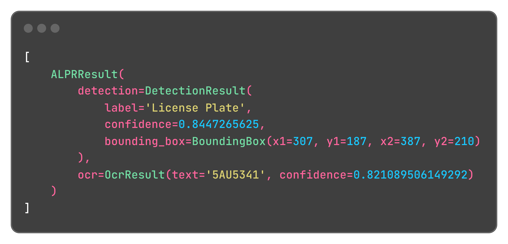
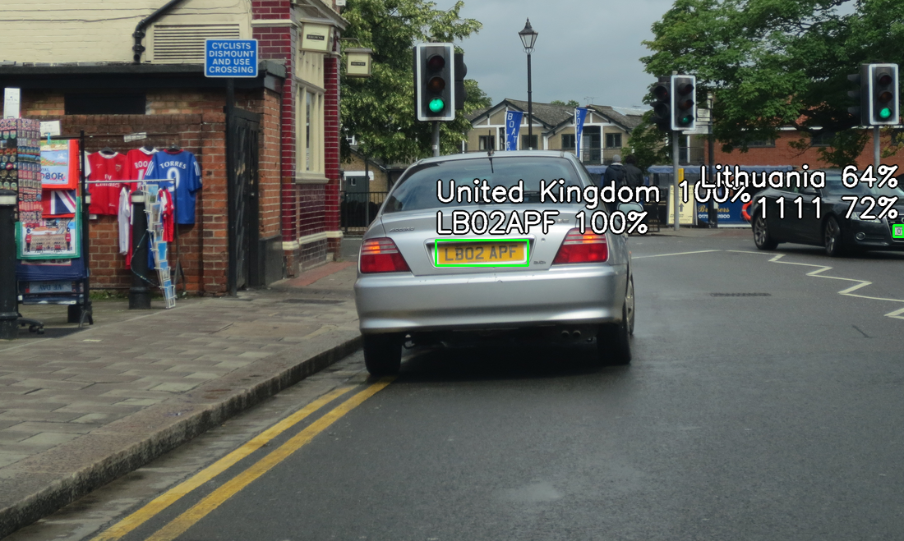

## 🚀 Quick Start

Here's how to get started with anpr-ocr:

### Predictions

```python
from anpr_ocr import ALPR

# You can also initialize the ALPR with custom plate detection and OCR models.
alpr = ALPR(
    detector_model="yolo-v9-t-384-license-plate-end2end",
    ocr_model="cct-xs-v2-global-model",
)

# The "assets/test_image.png" can be found in repo root dir
# You can also pass a NumPy array containing cropped plate image
alpr_results = alpr.predict("assets/test_image.png")
print(alpr_results)
```

???+ note

    See [reference](reference.md) for the available models.

Output:



### Draw Results

You can also **draw** the predictions directly on the image:

```python
import cv2

from anpr_ocr import ALPR

# Initialize the ALPR
alpr = ALPR(
    detector_model="yolo-v9-t-384-license-plate-end2end",
    ocr_model="cct-xs-v2-global-model",
)

# Load the image
image_path = "assets/test_image.png"
frame = cv2.imread(image_path)

# Draw predictions on the image and get the ALPR results
drawn = alpr.draw_predictions(frame)
annotated_frame = drawn.image
results = drawn.results
```

Annotated frame:


